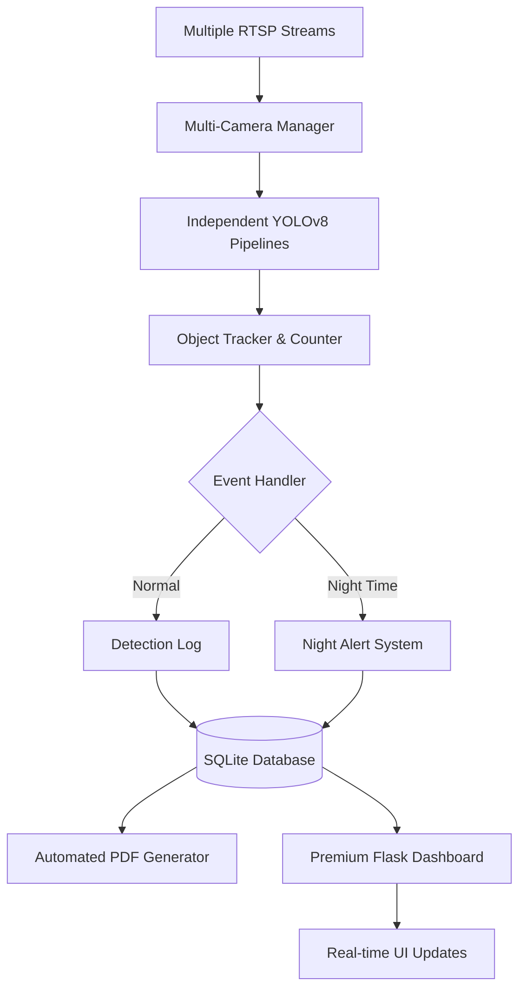

# 🛡️ Advanced Smart Surveillance System (v2.0)

<p align="center">
  
  
  
  
  
</p>

## 📌 Project Overview

**SmartEye AI v2.0** is an enterprise-grade AI surveillance dashboard. This version upgrades from a single-camera setup to a **Multi-Camera Command Center**, featuring real-time object detection, night movement alerts, and automated PDF reporting.

---

## ✨ New Advanced Features (v2.0)

- 🎥 **Multi-Camera Support**: Simultaneous monitoring of Gate, Room, and Parking via `config/cameras.json`.
- 🌙 **Night Movement Detection**: Automated alerts and logging for suspicious activity between **10 PM and 6 AM**.
- 📊 **Automated PDF Reports**: Daily generation of activity summaries including charts and statistics at **23:59**.
- 💎 **Premium Glassmorphism UI**: High-end white theme with animated cards, live status indicators, and a responsive grid layout.
- 📡 **Camera Health Monitoring**: Real-time detection of camera online/offline statuses with visual warnings.
- 🕒 **Activity Timeline**: Scrollable live feed of all system events and detections.
- 🆔 **License Plate Recognition (ALPR)**: Extraction and logging of number plates with cropped evidence storage.

---

## 🏗️ System Architecture



---

## 📂 Project Structure

```text
smart-surveillance/
├── config/              # Camera & System configurations
├── database/            # SQLite storage (surveillance.db)
├── detection/           # CV Logic (Detector, Tracker, Counter)
├── reports/             # Generated Daily PDF Reports
├── logs/                # System & Detection logs
├── images/              # Evidence snapshots (organized by camera/type)
├── static/              # Premium CSS, JS & Assets
├── templates/           # Flask HTML templates
├── main.py              # Application Entry Point
├── multi_camera_manager.py
├── report_generator.py
└── night_detector.py
```

---

## ⚙️ Installation & Setup

1. **Install Dependencies**:
   ```bash
   pip install -r requirements.txt
   ```

2. **Configure Cameras**:
   Edit `config/cameras.json` to add your RTSP links:
   ```json
   {
     "Gate": "rtsp://...",
     "Parking": "rtsp://..."
   }
   ```

3. **Run**:
   ```bash
   python main.py
   ```

---

## 👨‍💻 Author
**P. Vishnu Vardhan**  
*Internship Project — ITC Limited (PSPD)*
