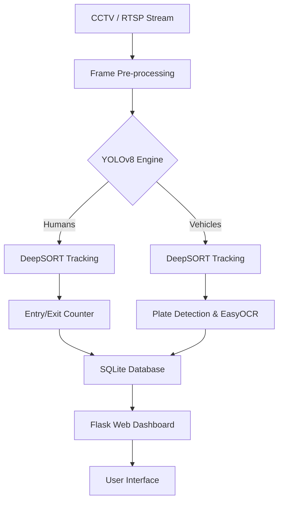

# 🛡️ Smart Surveillance System Using Computer Vision

<p align="center">
  
  
  
  
  
</p>

## 📌 Project Overview

**SmartEye AI** is an industrial-grade, real-time AI surveillance solution designed to transform standard CCTV feeds into intelligent monitoring systems. Leveraging state-of-the-art Deep Learning models, the system autonomously detects humans, classifies vehicles, recognizes license plates, and tracks movement patterns across restricted zones.

This project was developed to provide high-accuracy monitoring for industrial environments, ensuring safety, security, and automated data logging without human intervention.

---

## ✨ Key Features

- 👁️ **Real-Time Detection**: High-speed human and vehicle detection using **YOLOv8**.
- 🆔 **License Plate Recognition (ALPR)**: Automatic extraction of vehicle plate numbers using **EasyOCR**.
- 🏃 **Object Tracking**: Robust multi-object tracking via **DeepSORT** to prevent double counting.
- 🔢 **People Counting**: Intelligent bidirectional counting (Entries/Exits) with virtual tripwires.
- 📹 **RTSP Integration**: Native support for industrial CCTV camera streams.
- 📊 **Smart Dashboard**: Premium web interface with glassmorphism design for live monitoring and statistics.
- 💾 **Data Persistence**: Automatic logging of all detections, timestamps, and cropped evidence snapshots into an **SQLite database**.
- 🔍 **Historical Search**: Advanced filtering system to search detections by date, time, or plate number.

---

## 🏗️ System Architecture

The system follows a modular pipeline for high efficiency:



---

## 🧰 Technology Stack

- **Backend**: Python, Flask
- **Computer Vision**: OpenCV, Ultralytics YOLOv8
- **Tracking**: DeepSORT (Simple Online and Realtime Tracking with a Deep Association Metric)
- **OCR Engine**: EasyOCR
- **Database**: SQLite3
- **Frontend**: HTML5, Vanilla CSS3 (Glassmorphism), JavaScript (ES6+)
- **Protocol**: RTSP (Real-Time Streaming Protocol)

---

## 📂 Project Structure

```text
smart-surveillance/
├── database/            # SQLite database storage
├── datasets/            # Training/Validation datasets for YOLO
├── detection/           # Core CV logic (Detector, Tracker, Counter)
├── images/              # Evidence snapshots (People/Vehicles)
│   ├── persons/
│   └── vehicles/
├── logs/                # System activity logs
├── models/              # Pre-trained YOLO weights (.pt)
├── static/              # CSS (Poppins Font, Premium UI), JS
├── templates/           # Flask HTML templates (Dashboard, History, Search)
├── main.py              # Application Entry Point
├── requirements.txt     # Dependency list
└── README.md            # Documentation
```

---

## ⚙️ Installation & Setup

### 1. Clone the Repository
```bash
git clone https://github.com/VishnuVardhanCodes/Smart-Surveillance.git
cd Smart-Surveillance
```

### 2. Install Dependencies
It is recommended to use a virtual environment:
```bash
python -m venv venv
source venv/bin/activate  # On Windows: venv\Scripts\activate
pip install -r requirements.txt
```

### 3. Configure RTSP Link
Edit the `.env` file or directly update `main.py` with your camera URL:
```env
CCTV_RTSP_URL=rtsp://username:password@ip_address:port/stream
```
*(Use `0` for local webcam testing)*

### 4. Run the Application
```bash
python main.py
```
Access the dashboard at: `http://localhost:5000`

---

## 🔍 How It Works

1.  **Inference**: The system captures frames from the RTSP stream and passes them to the **YOLOv8** model.
2.  **Tracking**: Each detected object is assigned a unique ID by **DeepSORT**, maintaining identity across frames even during occlusions.
3.  **Counting**: When a person's centroid crosses the pre-defined digital line, the **Counter** increments the "In" or "Out" count.
4.  **Logging**: Upon first confirmation of an object, a high-quality crop is saved to the `images/` directory, and a metadata entry is created in `surveillance.db`.
5.  **Monitoring**: Users view the live feed and analytics through the **Flask-based Dashboard**.

---

## 🎯 Use Cases

- 🏭 **Industrial Safety**: Monitoring worker presence in hazardous zones.
- 🚗 **Parking Management**: Tracking vehicle entry/exit and logging license plates.
- 🏢 **Smart Buildings**: Real-time occupancy tracking for HVAC and lighting optimization.
- 🛡️ **Security**: Automated intrusion detection and evidence gathering.

---

## 🔮 Future Enhancements

- [ ] **Face Recognition**: Integration for authorized personnel identification.
- [ ] **Cloud Sync**: Automatic backup of evidence images to AWS S3 / Azure Blob.
- [ ] **Multi-Camera Grid**: View up to 4 cameras simultaneously on the dashboard.
- [ ] **Instant Alerts**: Telegram/Email notifications for specific detection triggers.

---

## 👨‍💻 Author

**P. Vishnu Vardhan**  
*Internship Project — ITC Limited (PSPD)*  
[GitHub Profile](https://github.com/VishnuVardhanCodes) | [Connect on LinkedIn](https://linkedin.com/in/your-profile)

---

<p align="center">
  Developed with ❤️ for Advanced Smart Surveillance
</p>
